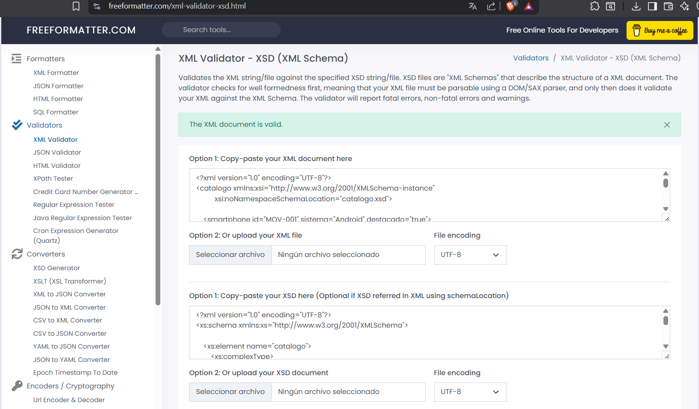

# Validación del archivo catalogo.xml

## 1. Herramientas utilizadas

### Validación XSD (VITALIY IVANETS)
* **Herramienta:** Visual Studio Code
* **Extensión:** XML (Red Hat)
* **Versión:** Actualizada a 2026.

### Validación DTD (Parte del compañero)
*.....

## 2. Proceso de validación

### Validación contra XSD
He validado el archivo XML usando el esquema `catalogo.xsd`.
1.  Enlacé el esquema en la cabecera del XML (`xsi:noNamespaceSchemaLocation`).
2.  Visual Studio Code validó la estructura en tiempo real.
3.  Ademas use la pagina https://www.freeformatter.com/xml-validator-xsd.html para validar para la imagen de la entrega.
3.  Comprobé que no hubiera errores en la lista de problemas.

**Captura de pantalla XSD:**

### Validación contra DTD
*....

## 3. Decisiones de diseño (XML y XSD)

### ¿Por qué usar elementos o atributos?
Para mi parte del XML, he decidido:
* **Atributos:** Para datos técnicos cortos como el `id` (MOV-XXX), el sistema operativo o si está `destacado`. Son metadatos.
* **Elementos:** Para todo lo que el usuario ve en la web (marca, modelo, descripción). También he usado elementos para datos complejos como las `<especificaciones>` y la lista de `<colores>`.

### Restricciones XSD aplicadas
He programado estas reglas en el XSD para asegurar que los datos sean correctos:

1.  **ID (Pattern):** He obligado a que siga el formato "MOV-" seguido de 3 números.
2.  **Marcas (Enumeration):** He limitado las opciones solo a las marcas que vendemos (Apple, Samsung, Motorola, Xiaomi).
3.  **Precio (Rango):** He puesto un mínimo de 10€ y máximo de 3000€ para evitar errores.
4.  **Colores (Hexadecimal):** Obligo a usar el formato de 6 dígitos (#FFFFFF) para que funcione bien en la web.
5.  **Stock (Boolean):** He forzado el uso de `true/false` para cumplir con el estándar XML.

## 4. Conclusiones

En mi parte del trabajo (XML y XSD), el principal reto fue ajustar los tipos de datos. Por ejemplo, tuve que cambiar los valores de "si/no" a `true/false` porque el validador XSD es estricto con los booleanos. También tuve que estandarizar los códigos de color hexadecimales para que cumplieran con el patrón definido(VITALIY IVANETS).
