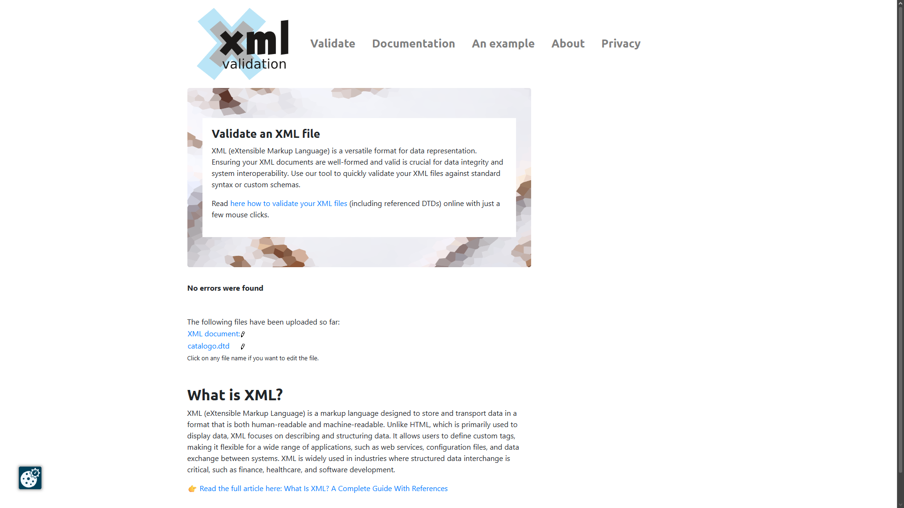

# Validación del archivo catalogo.xml

## 1. Herramientas utilizadas

### Validación XSD (VITALIY IVANETS)
* **Herramienta:** Visual Studio Code
* **Extensión:** XML (Red Hat)
* **Versión:** Actualizada a 2026.

### Validación DTD (NICOLÁS AMOEDO)
* **Herramienta:** [xmlvalidation](https://www.xmlvalidation.com/index.php?id=1&L=0)

## 2. Proceso de validación

### Validación contra XSD
He validado el archivo XML usando el esquema `catalogo.xsd`.
1.  Enlacé el esquema en la cabecera del XML (`xsi:noNamespaceSchemaLocation`).
2.  Visual Studio Code validó la estructura en tiempo real.
3.  Ademas use la pagina https://www.freeformatter.com/xml-validator-xsd.html para validar para la imagen de la entrega.
3.  Comprobé que no hubiera errores en la lista de problemas.

**Captura de pantalla XSD:**

### Validación contra DTD
He validado el archivo XML usando `catalogo.dtd`.
1. Enlacé el DTD en la cabecera del XML (`<!DOCTYPE catalogo SYSTEM "catalogo.dtd">`).
2. Subi el archivo catalogo.xml a xmlvalidation.
3. Subi el archivo catalogo.dtd a xmlvalidation.
4. xmlvalidation valido ambos archivos y comprobo que no habia errores.

**Captura de pantalla DTD:**

## 3. Decisiones de diseño (XML y XSD)

### ¿Por qué usar elementos o atributos?
Para mi parte del XML, he decidido:
* **Atributos:** Para datos técnicos cortos como el `id` (MOV-XXX), el sistema operativo o si está `destacado`. Son metadatos.
* **Elementos:** Para todo lo que el usuario ve en la web (marca, modelo, descripción). También he usado elementos para datos complejos como las `<especificaciones>` y la lista de `<colores>`.

### Restricciones XSD aplicadas
He programado estas reglas en el XSD para asegurar que los datos sean correctos:

1.  **ID (Pattern):** He obligado a que siga el formato "MOV-" seguido de 3 números.
2.  **Marcas (Enumeration):** He limitado las opciones solo a las marcas que vendemos (Apple, Samsung, Motorola, Xiaomi).
3.  **Precio (Rango):** He puesto un mínimo de 10€ y máximo de 3000€ para evitar errores.
4.  **Colores (Hexadecimal):** Obligo a usar el formato de 6 dígitos (#FFFFFF) para que funcione bien en la web.
5.  **Stock (Boolean):** He forzado el uso de `true/false` para cumplir con el estándar XML.

## 4. Conclusiones

En mi parte del trabajo (XML y XSD), el principal reto fue ajustar los tipos de datos. Por ejemplo, tuve que cambiar los valores de "si/no" a `true/false` porque el validador XSD es estricto con los booleanos. También tuve que estandarizar los códigos de color hexadecimales para que cumplieran con el patrón definido(VITALIY IVANETS).

## 5. Decisiones de diseño (DTD)

Para la estructura definida en el DTD, he decidido distribuir la información de la siguiente manera:

* **Atributos:** Los he usado para etiquetas cortas que ayudan al sistema a clasificar el móvil. Por ejemplo, el id (obligatorio y único), el sistema (Android o iOS) y el estado destacado. También se usa un atributo fijo para la moneda ("EUR") en el precio y el código hex para definirlos colores.

* **Elementos:** He reservado los elementos para el contenido informativo y descriptivo que consume el usuario final, como la marca, el modelo y la descripcion. Tambien se han empleado elementos para agrupar datos relacionados, como en el caso de las especificaciones (que engloban almacenamiento, ram y fecha) y la lista de colores.

### Atributos DTD aplicados:

* **Identificadores Únicos (ID):** Se ha definido el atributo id como tipo ID, lo que obliga a que cada smartphone tenga un código único e irrepetible en el documento.

* **Valores Enumerados (Sistema):** He limitado las opciones del sistema operativo estrictamente a Android o iOS para evitar errores de escritura.

* **Booleano Simulado (Destacado):** Se ha restringido el atributo destacado a los valores true o false.

* **Jerarquía Obligatoria:** He definido que cada smartphone debe contener  una sola vez los elementos de marca, modelo, precio, descripción, especificaciones y stock, y permitiendo uno o más elementos de color.

* **Atributos Fijos y Requeridos:** Se ha establecido que la moneda del precio sea siempre EUR mediante #FIXED y que cada color deba incluir obligatoriamente su código hexadecimal con #REQUIRED.

## 6. Conclusiones
En la elaboración del DTD, el principal paso para su elaboración fue definir una estructura rígida que validara correctamente la jerarquía del XML, especialmente al manejar elementos anidados como las especificaciones. A diferencia de un XSD, el DTD no permite validar patrones complejos (como el formato exacto de una fecha o un código hexadecimal), por lo que la precisión en la definición de las listas de atributos (ATTLIST) fue necesario para asegurar que valores como el sistema operativo o que el estado de destacado no contuvieran datos inconsistentes. El resultado es un catálogo que garantiza que cada smartphone registrado cuente con toda la información técnica necesaria para su visualización comercial.